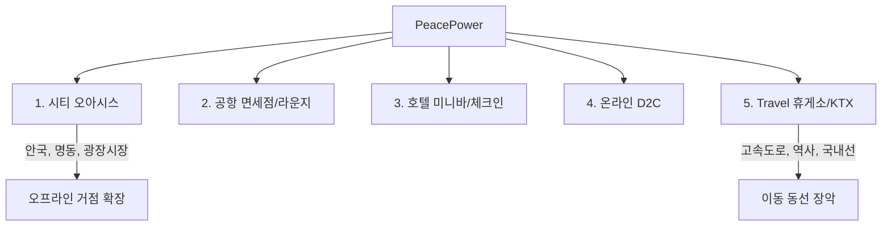

# PROPER MARKET 디자인팀 — 온보딩 지식 베이스


==================================================
# [문서] 프로퍼마켓_디자인팀_종합_인사이트
==================================================

# 프로퍼마켓 디자인팀 종합 인사이트 (v3)

> 옵시디언 볼트의 전체 데이터를 종합한 리포트.
> **What(사실)과 Why(이유)만 담았다. How(풀어내는 방식)는 의도적으로 비워두었다.**
> 우리만의 방식을 찾아 채울 영역이다. 기존 브랜딩의 틀에 갇히지 않기 위해.

---

## 0. 지금 프로퍼마켓이 서 있는 곳

### 미션이 바뀌었다

| 이전                        | 현재                                   |
| ------------------------- | ------------------------------------ |
| Wellness for All (건강 민주화) | **Design better Life** (더 나은 삶을 디자인) |

**왜**: "웰니스"가 Commodity Language가 되고 있다. 올리브베러, 트웰브, 수많은 커머스, 뷰티 회사 — 모두가 웰니스를 남발할 것이고, K-뷰티 다음은 K-웰니스다. '웰니스 = 건강' 축에서 모두 경쟁하게 된다. 좋은 원료와 PROPER MADE만으로는 예선 통과다. 새 카테고리가 필요하다.

**프로퍼마켓은 더 이상 웰니스 커머스가 아니다. 더 나은 삶을 디자인하는 브랜드다.**

---

### 탈 브랜딩 — 정반합

```
[정] 기존 브랜딩 (최근 5년)
     로고, 컬러, 폰트 시스템 → 선두 브랜드를 따라함
     결과: 거의 모든 회사가 "브랜드처럼 보이는 것"을 잘 함

[반] 탈 브랜딩 / 안티 브랜딩
     기존 공식을 의도적으로 벗어남
     "브랜드처럼 보이는 것"이 아님. 프로퍼마켓만의 방식으로 존재

[합] 독자적 실행
     기반은 이해하되, 그 틀에 갇히지 않는다
     기반 위에서 풀어내는 방식에서 독보성이 나온다
```

**안티 브랜딩의 핵심**: 브랜딩을 안 하는 것이 아니라, **그런 브랜딩처럼 보이지 않게 하는 브랜딩**. 겉은 자유롭지만 속에서는 중심과 기준이 있다. 감각 좋은 자영업자처럼 보이게 한다.

---

### 90/10에서 '1'로

| 90/10 (지금까지) | '1' (앞으로) |
|---|---|
| 시장에서 검증된 구조 기반 | 기준 자체를 새로 정의 |
| 개선의 전략 | 카테고리 창출의 전략 |
| 준수한 좋은 브랜드 | **시장에서 독보적인 카테고리 점령** |

> '1'의 조건: 너무 익숙하면 차별이 없고, 너무 새로우면 이해되지 않는다.
> **이해할 수 있지만 처음 보는 것을 만들어야 한다.**

---

## 1. 고객이 말하는 사실 — 14건의 인터뷰

### 1.1. 신뢰는 '스펙'이 아니라 '감각'에서 온다

| 표현 | 빈도 | 의미 |
|---|---|---|
| "알갱이", "건더기", "원물감" | 12/14명 | 신뢰의 근거가 성분표가 아니라 **질감 체험** |
| "다르다", "이건 진짜" | 10/14명 | 기존 두유와 **카테고리 자체가 다르다**는 자발적 인식 |
| "든든함", "속 편안함" | 9/14명 | 구매 동기가 기능이 아니라 **섭취 후 감정** |
| "루틴", "습관", "매일" | 11/14명 | 일회성 구매가 아닌 **일상 편입** |
| "두유계의 에르메스" | 고객 자체 명명 | 브랜드가 아닌 **고객이 먼저 규정한 위치** |

> 고객은 "단백질 16g"이 아니라 "진짜 콩물의 알갱이"에서 신뢰를 형성한다. 이 사실은 변하지 않는다.

---

### 1.2. 두 제품은 다른 감정을 건드린다

| 감정 축 | 제품 | 욕구 단계 |
|---|---|---|
| **안심** — "첨가물 없어서 안심", "아이에게 먹여도 걱정 없음" | 서콩두 | 매슬로우 2단계 (안전) |
| **뿌듯함** — "오늘도 챙겼다", "달달한 것 대신 절제" | LAZY SALAD · 루틴 고객 | 매슬로우 4~5단계 (존중·자아실현) |

---

### 1.3. 가족 내 전파 = 핵심 성장 엔진

```
한 사람 구매 → 만족 → 가정 내 공유 → 가족 섭취 → 라인 확장 구매
```

프로퍼마켓의 성장은 광고→전환보다 **사람→사람** 전파에 더 강하게 의존한다.

---

### 1.4. 충성 고객의 두 유형

| 유형 | 특성 | 이탈 가능성 |
|---|---|---|
| **구조적 대체 불가** | 유당불내증, 항암 후 성분 민감 등 | 거의 없음 |
| **정서적 애착** | "에르메스", 재입고만 대기 | 낮음 |
| **편의성 기반** | "단종 시 대체 탐색" | **있음** |

---

### 1.5. LAZY SALAD 리뉴얼 팩트

- 용량 축소에 **명확히 부정적** (김미정, 김지용)
- 비트 흙 냄새·변색 → 신선도 불안 유발 (이은정)
- 건더기·꾸덕한 질감은 **핵심 가치** — 유지 필수 (한지영)
- 프리미엄 라인 수요 존재 (박성제)

---

## 2. 이론이 팩트와 만났을 때 드러나는 것

### 2.1. 피터 틸 — 고객이 이미 카테고리를 분리했다

"두유라고 생각 안 하고 콩물 먹는다고 생각" (이은정) → **0→1이 고객 수준에서 이미 작동.**

### 2.2. 정김경숙 — "소수 집중 = 신뢰"가 실증됨

"소수 제품에 집중하는 브랜드에서 오히려 신뢰" (김지용) → 4개 제품 확장 시 이 신뢰가 **희석될 수 있다는 구조적 리스크.**

### 2.3. 버네이스 — 고객은 제품이 아니라 '개념'을 산다

"건강한 아침식사 느낌" (민다한), "종합비타민 먹는 느낌" (박성제) → **피아노가 아닌 음악실을 이미 구매 중.** 이것이 Design Better Life 시스템과 정확히 일치.

### 2.4. 르 봉 — "비순응의 감염"이 일어나고 있다

"성분표를 직접 확인하는 습관" (민다한, 박성제, 김미정) → 고객이 외부 권위가 아닌 **자기 판단으로 선택**하고 있다. "나다움의 비타협"이 공명 중.

### 2.5. 하라리 — PROPER MADE는 아직 "상상의 질서"가 되기 전

물질 세계 내재화 ⏳ · 욕망 형성 ❌ · 상호 주관성 ❌ → 3조건 충족에 시간과 실행이 필요.

### 2.6. 욕망 이론 — 고객은 "안전" 너머에 이미 있다

대부분의 건강식품이 2단계(안전)에서 말하지만, 프로퍼마켓 고객은 이미 4~5단계(존중·자아실현)를 체감. **안전 메시지에만 머물면 고객이 느끼는 가치보다 아래에서 말하게 된다.**

---

## 3. 새로 추가된 전략이 기존 팩트와 만나면

### 3.1. Design better Life 시스템 × 고객 데이터

Design Better Life의 6단계 시스템:
```
사람 → 라이프스타일 제시 → 루틴(사용접점) → 커뮤니티 → 상품이 낀다 → 네트워크 확산
```

고객 인터뷰에서 **이미 이 구조가 자연 발생**하고 있다:

| 시스템 단계 | 이미 발생한 증거 |
|---|---|
| 사람이 있다 | 14명의 실제 인물과 루틴 |
| 라이프스타일 제시 | "아침 공복에 한 잔" — 전 고객 공통 |
| 루틴(사용접점) | 서콩두→운동→LAZY SALAD 연결 루틴 (박성제, 민다한) |
| 커뮤니티(함께) | 가족 내 전파, 부부 함께 섭취, 부모님 추천 |
| 상품이 자연스럽게 안에 있음 | "건강한 아침" 개념 안에 서콩두가 자연스럽게 존재 |
| 네트워크 확산 | "두유계의 에르메스"로 지인에게 선물, 가족 추천 |

**사실**: Design Better Life는 새로 만들어야 할 것이 아니라, **이미 고객이 살고 있는 방식을 인식하고 시스템화하는 것**이다.

---

### 3.2. Want(욕망) 설계 × 고객 언어

고객이 구매하는 5가지 레이어와 실제 고객 데이터:

| 레이어 | 고객이 실제로 말한 것 |
|---|---|
| **Want(욕망)** | "하루에 한 개 먹는 건데 좋은 걸 먹고 싶다" (민다한) |
| **감각** | "알갱이가 보여서 진짜구나 느꼈다" (김동훈) |
| **의미** | "건강을 잘 챙기고 있다는 뿌듯함" (박성제) |
| **기호** | "두유계의 에르메스" (노일주) — 남들에게 보여지는 신호 |
| **세계관** | "건강해지는 맛" (김지용) — 건강은 억지가 아니라 즐기는 것 |

> **고객은 상품을 이해해서 사는 것이 아니라 느껴서 산다.** 이것은 고객 데이터로 실증됨.

---

### 3.3. 이야기 자본 × 프로퍼마켓

이야기 자본의 3가지 서사와 프로퍼마켓 현재 상태:

| 서사 유형      | 정의                         | 프로퍼마켓 현재                                      |
| ---------- | -------------------------- | --------------------------------------------- |
| **브랜드 서사** | 우리가 누구이며 왜 이 일을 하는가        | 독보성 에세이, PROPER MADE 스토리에 존재                  |
| **관계 서사**  | 고객의 일상이 주인공 (브랜드는 무대 뒤로)   | Design better Life "Your Routine" 시리즈 — 설계 단계 |
| **뿌리 서사**  | 모든 이야기의 중심이 되는 가장 결정적인 이야기 | "Design better Life" + "PROPER MADE"          |

| 개념 | 사실 |
|---|---|
| **고착도(Stickiness)** | 인터뷰 14명 중 구조적 대체 불가 + 정서적 애착 고객이 대다수 → 이미 고착도가 높다 |
| **에피소드 vs 내러티브** | 독보성 에세이의 핵심과 동일 — "유행 따라 바꾸면 에피소드, 주제 의식을 유지하면 내러티브" |
| **관계 서사 원칙** | "아무도 당신의 브랜드에 관심 없다" — 안티 브랜딩과 정확히 같은 방향. 브랜드 자의식 배제 |
| **무의식 / 거트 필링** | 구매 결정의 95%가 무의식 — Want(욕망) 설계의 이론적 근거 |

---

### 3.4. 안티 브랜딩 × 관계 서사 = 같은 방향

| 안티 브랜딩 | 관계 서사 (이야기 자본) | 공통점 |
|---|---|---|
| 기업·회사처럼 말하지 않는다 | 브랜드의 자의식을 경계해야 한다 | **자기 자랑 배제** |
| 취향과 선택처럼 보이게 한다 | 고객의 일상이 주인공 | **고객 중심** |
| 감각 좋은 자영업자 | 정체성을 선물한다 | **정보가 아닌 느낌** |

→ 이야기 자본 아티클이 말하는 "관계 서사"와 대표님의 "안티 브랜딩"은 **같은 것을 다른 언어로 말하고 있다.**

---

## 4. PROPER MADE — 모든 이론이 수렴하는 곳

| 참고자료 | 말해주는 것 |
|---|---|
| 피터 틸 | 새로운 카테고리(0→1) 창조 행위 |
| 트레이더 조 | 큐레이터 포지션 — 선택성이 가치 |
| 버네이스 | 마크가 아니라 "제대로 먹는다는 것"이라는 개념을 심는다 |
| 르 봉 | 단언·반복·감염 → 일관된 시각 언어 |
| 하라리 | 상상의 질서 3조건 충족이 필요 |
| 잭 트라우트 | 최초가 되면 그 자리는 빼앗기지 않는다 |
| **이야기 자본** | PROPER MADE = **뿌리 서사(Root Narrative)**의 물질적 표현 |

**추가 발견**: 이야기 자본의 "뿌리 서사"와 독보성 에세이의 "자가포식 증식 구조"는 같은 구조다 — 중심이 있고, 그 중심에서 모든 이야기가 나온다.

---

## 5. 위협 요인

### 5.1. 카피캣이 복사할 수 있는 것 vs 없는 것

| 복사 가능 | 복사 불가능 |
|---|---|
| 개별 패키지 | **시스템** (르 봉) |
| 제품 스펙·성분 | **"제대로 먹는다는 것"이라는 개념** (버네이스) |
| 광고 카피 | **뿌리 서사** (이야기 자본) + **10% 차별화의 다층 축적** (독보성 에세이) |
| 원물 사진 | **안티 브랜딩의 톤** — 따라하면 기존 브랜딩처럼 보여서 실패 |

### 5.2. LAZY SALAD 리뉴얼 리스크

- 용량 축소 + 맛 변경 + PROPER MADE 마크 + **BI 전면 리뉴얼(매마샐 → LAZY SALAD)** 동시 적용이 3Q 2026에 겹침
- 마크가 2Q까지 확정 안 되면 전체 일정 차질
- 신규 BI 전환 리스크: 기존 "매마샐" 자산(고객 인지, 검색어, 광고 소재, 리뷰) 초기화 구간 발생

### 5.3. Design Better Life의 콘텐츠 실행 리스크

이야기 자본이 경고하는 것:
- **팔겠다는 욕망이 드러나면 관계 서사는 실패한다** — 안티 브랜딩 원칙과 동일
- **어설프게 만들면 오히려 브랜드를 깎는다** — 날것이지만 미감은 높아야 한다
- **뿌리 서사 없이 콘텐츠를 쌓으면 에피소드만 남는다** — 중심이 선명해야 한다

---

## 6. OKR별 핵심 팩트

| OKR | 사실 |
|---|---|
| **O1 (전환 UX)** | 구매 결정 트리거 순서: ①원물감 ②성분 단순함 ③비슷한 사람 ④체감 감정. **정량 베이스라인(2026.04.30):** 전체 CVR 3.14%, 조회→회원 Page 이탈 79.2%(최대 leak), 1분 미만 체류 90.6% → [[01. 베이스라인 리포트\|베이스라인 리포트 전체]] |
| **O2 (콘텐츠)** | 고객 입말 자체가 소재. "닭가슴살 대신 두유 한 팩"(김동훈), "두유계의 에르메스"(노일주). **관계 서사 + Want 설계의 실행 채널** |
| **O3 (포트폴리오)** | 12/14명 원물감이 구매 결정 요인. 용량 축소 부정적. '1'의 조건("이해할 수 있지만 처음 보는 것") 적용 필요 |
| **O4 (BI)** | 4개 제품 동시 운영 시 "공통과 차이"의 구조적 해결. 단, 기존 브랜딩 공식을 따르면 안티 브랜딩과 충돌 |

---

## 7. 한 장 요약

| # | 사실 (What) | 왜 중요한가 (Why) |
|---|---|---|
| 1 | 미션이 **Design Better Life**로 바뀌었다 | 웰니스는 Commodity가 된다. 새 카테고리 필요 |
| 2 | **탈 브랜딩 / 안티 브랜딩**이 방향이다 | "브랜드처럼 보이는 것" 자체가 평균이 된 시대 |
| 3 | 90/10에서 **'1' 만들기**로 전환한다 | 개선이 아닌 **카테고리 창출**이 독보성 |
| 4 | 고객은 **감각(원물감)**으로 신뢰하고, **이미 카테고리를 분리**했다 | 0→1이 고객 수준에서 작동 중 |
| 5 | 고객은 제품이 아니라 **개념·욕망·감각·기호·세계관**을 산다 | 상품 설명이 아닌 **Want 설계**가 핵심 |
| 6 | Design Better Life 시스템은 **이미 고객이 살고 있는 방식**이다 | 새로 만드는 것이 아니라 인식하고 시스템화하는 것 |
| 7 | 관계 서사(이야기 자본)와 안티 브랜딩은 **같은 방향**이다 | 브랜드 자의식 배제, 고객의 삶이 주인공 |
| 8 | PROPER MADE는 **뿌리 서사의 물질적 표현**이다 | 모든 이론이 동시에 가리키는 방향 |

---

## 관련 데이터

- [[01. 베이스라인 리포트]] — O1 정량 베이스라인: CVR, 퍼널 이탈, 체류시간, 매체 효율 (2026.01.28~04.28 · 91일)
- [[00. 프로젝트 개요|UXUI 개선 프로젝트]] — 프로젝트 허브 (개선 전/후 비교 포함)
- [[고객 입장 연구소]] — 본 문서의 정성 데이터 원본
| 9 | 카피캣이 복사할 수 없는 것은 **시스템·개념·뿌리 서사** | 안티 브랜딩의 톤은 따라하면 실패하는 구조 |

---

> *"독보성은 만들 때는 늘 이상해 보이고, 성공한 뒤에야 당연해 보인다."*
> — 대표 독보성 에세이
>
> *"에피소드는 쌓이지 않는다. 내러티브는 시간이 쌓일수록 단단해진다."*
> — 최장순 (이야기 자본)
>
> *"고객은 상품을 이해해서 사는 것이 아니라 느껴서 산다."*
> — Want 욕망 설계
>
> 이 리포트는 **"무엇이 사실인가"**와 **"왜 그런가"**만 담았다.
> **"어떻게 풀어낼 것인가"는 우리만의 방식으로 채울 것이다.**
> 기존 브랜딩의 틀에 갇히지 않기 위해.


==================================================
# [문서] PROPER MADE
==================================================

---
tags:
  - PROPER-MARKET
  - Branding
  - Sub-Brand
status: In Progress
created: 2026-02-18
---

# PROPER MADE

> "제대로 만든다" — 프로퍼마켓의 철학을 외부에 알리고, 브랜드 자산으로 만드는 서브 브랜드 / 인증 마크 시스템

---

## 0. 기호학적 위치 — 기표에서 기의로

### 현재 상태

> [!warning] 현재 PROPER MARKET과 PROPER MADE는 둘 다 **기표(記標, signifier)** 다.

- **PROPER MARKET** = 브랜드 이름, 로고, 매장 — 표면에 보이는 형식
- **PROPER MADE** = 현재는 또 하나의 마크, 또 하나의 이름 — 역시 표면

지금 단계에서는 PROPER MADE가 의미를 갖는 **형식(기표)** 에 불과하다. 소비자에게 "PROPER MADE가 뭔지" 설명이 필요한 상태 = 아직 기의가 없는 기표.

### 전환 목표

```
현재: PROPER MARKET(기표) ─── PROPER MADE(기표)
                                       ↓ 전환 목표
미래: PROPER MARKET(기표) ───→ PROPER MADE(기의)
      "프로퍼마켓이라는 브랜드"    "제대로 만든다는 개념 자체"
```

PROPER MADE가 **기의(記意, signified)** 가 된다는 것:
- 소비자가 마크를 봤을 때 **설명 없이 "제대로 만든 것"이라는 개념이 즉각 연상**되는 상태
- 미슐랭 별이 "설명 없이 최고 수준의 레스토랑"을 의미하게 된 것과 같은 구조
- 이 상태에 도달해야 인증 라벨 비즈니스·외부 확장이 의미를 가진다

### 왜 이 전환이 중요한가

Phase 3(외부 인증 마크, 라이센싱)은 PROPER MADE가 기의로 기능할 때만 가능하다. 단순한 마크(기표)를 외부 제품에 붙이는 것은 의미가 없다. **그 마크가 "제대로"라는 개념을 이미 담고 있을 때** 외부 제품이 그 개념을 빌릴 수 있다.

---

## 0-1. 브랜드 아키텍처 — 선택적 적용의 원칙

### PROPER MARKET과 PROPER MADE의 연결 구조

> [!important] PROPER MARKET이 만드는 모든 것이 PROPER MADE가 되는 것이 아니다.

PROPER MADE의 기준에 **부합하는 것에만** 마크가 붙는다. 이 선택성이 마크의 가치를 만든다.

```
PROPER MARKET이 만드는 것들
        │
        ├─── PROPER MADE 기준 충족 ──→ PROPER MADE (기의로 향하는 경로)
        │    (제조 공정, 원료, 성분 투명성 등)
        │
        └─── 나머지 전반 ─────────→ PROPER MARKET (기표) 직접 귀속
             (일반 마케팅, 이벤트, PROPER MADE 기준 미충족 영역)
```

이 이분법이 PROPER MADE의 선택성을 가장 명확하게 만든다. "PROPER MADE가 아닌 것들"을 위한 별도 기표를 지금 단계에서 만들 필요는 없다. 오히려 그렇게 하면 구조가 산발된다.

### 선택성이 왜 작동하는가

마크의 가치는 **붙지 않는 것**이 있을 때 생긴다. 모든 것에 붙으면 그냥 로고가 된다. PROPER MADE가 "기준을 통과한 것"이라는 의미를 갖으려면, 통과하지 못한 것도 존재해야 한다.

| 레퍼런스 | 선택적 적용 방식 | 결과 |
|:---|:---|:---|
| 미슐랭 스타 | 전체 레스토랑 중 극소수만 수여 | 별 자체가 기준의 상징이 됨 |
| Swiss Made | 스위스산 부품 60% 이상 + 제조·검사 스위스 내 | 조건 미충족 시 표기 불가 |
| 파타고니아 1% | 자사 제품 전체 적용 + 인증 기업만 로고 사용 | 인증 자체가 브랜드 가치로 전환 |

### 현재 PROPER MARKET의 콘텐츠·제품 분류 (초안)

| 영역 | PROPER MADE 적용 여부 | 근거 |
|:---|:---|:---|
| 서콩두, LAZY SALAD, 소프트 프로틴, 피스파워 | ✅ 적용 | 자사 제조, 공정 투명성 확보 가능 |
| 큐레이션 제품 (장바구니 상품) | 🔄 기준 검토 후 | "프로퍼마켓이 검증한 제품" — Phase 2 |
| 콘텐츠 시리즈 (아티스트 인터뷰 등) | ✅ 적용 | "제대로 만드는 사람들"의 이야기 |
| 일반 브랜드 SNS, 이벤트 | ❌ 미적용 | PROPER MARKET 직접 귀속 |
| 일반 마케팅, 이벤트, 기타 | ❌ 미적용 | PROPER MARKET 기표 직접 귀속 |

---

## 1. 개요

프로퍼마켓에는 **"제대로 만든다"** 는 철학이 있다. 이 기준을 외부에 알리고, 브랜드 자산으로 만든다.

| # | 목적 | 설명 |
|---|------|------|
| 1 | **차별화** | 타 브랜드, 카피캣과 차별화되는 기준 필요 |
| 2 | **브랜드 자산** | "프로퍼마켓다움" 브랜드 자산 구축과 시각적 체계화 |
| 3 | **사업 확장** | 자사 품질 기준에서 외부 제품 인증 마크로의 확장 |

### 벤치마킹 레퍼런스

- 미슐랭 가이드
- Swiss Made
- Made in Japan
- 제품 공정 인증 마크 (HACCP, Vegan 등)

---

## 2. 메시지 전략

### 프레이밍 전환: 공급자 → 소비자 정체성

> [!important] 핵심 전환
> "우리가 제대로 만들었다" (공급자 시점)
> → **"제대로 된 것을 고를 줄 아는 당신"** (소비자 정체성 시점)

소비 결정의 70~80%는 무의식적으로 일어난다. "제대로 만든다"는 이성적 품질 언어이고, 이것만으로는 차별화가 약하다. PROPER MADE가 소비자의 **정체성 표현 도구**가 되어야 한다.

| 욕구 단계 | 현재 위치 | 도달해야 할 위치 |
|-----------|----------|----------------|
| 매슬로우 2단계 — **안전 욕구** | "이 제품은 안전합니다" | — |
| 매슬로우 4단계 — **존중 욕구** | — | "이 기준을 아는 당신은 다릅니다" |
| 라이스 — **명예(Honor)** | — | 자기 가치에 충실하려는 욕구와 연결 |

→ 참조: [[인간의 욕망의 종류]]
→ 참조: [[브랜드 심볼 · 키워드 심층 분석#4.2. 에드워드 버네이스 — 정체성을 판다, 제품이 아니라]] — "제대로 고를 줄 아는 당신" → **"자기 기준을 가진 당신"** 으로의 프레이밍 보강

### 보이스 톤 정의

PROPER MADE는 **설명하지 않는다. 선언한다.**
그러나 그 선언의 톤은 위압이 아니라 **확신에서 오는 차분함**이다.

| 원칙 | 예시 |
|------|------|
| **단언** | "제대로 만들었습니다"를 논증이 아닌 선언으로. 길게 설명하지 않는다 |
| **반복** | 패키지, 상세페이지, 콘텐츠, SNS — 모든 터치포인트에서 동일한 시각·언어 요소 반복 |
| **감염** | 소비자가 "나도 PROPER MADE 제품 먹어"라고 자발적으로 공유하는 구조 설계 |

→ 참조: [[군중심리 — 귀스타브 르 봉]] — 단언·반복·감염의 설득 구조

---

## 3. 콘텐츠 확산 전략: 캐스케이드 모델

> [!quote] 버네이스의 피아노 음악실 원리
> "똑똑한 PR은 피아노를 팔지 않는다. '가정 음악실'이라는 개념을 판다."
> → PROPER MADE도 인증 마크를 팔지 않는다. **"제대로 먹는다는 것"이라는 문화적 개념**을 먼저 만든다.

콘텐츠 전략은 곧 **기표에서 기의로의 전환 전략**이기도 하다. 마크(기표)를 반복 노출하는 것이 아니라, "제대로"라는 개념(기의)이 사람들 사이에서 먼저 공유될 때 마크는 그 개념의 상징이 된다.

→ 참조: [[프로파간다 — 에드워드 버네이스]] — 5대 간접 설득 기법

### 3단계 확산 구조

```
1단계: 개념 창출
   "제대로 먹는다는 것" — 제품이 아닌 라이프스타일 개념을 먼저 만든다

2단계: 제3자 권위 확보
   독립적이고 신뢰할 수 있는 사람들의 보증을 얻는다

3단계: 대중의 자발적 수용
   PROPER MADE 마크를 보면 "이게 제대로 된 거구나" 자연스럽게 인식
```

### 단계별 실행

| 단계 | 대상 | 실행 |
|------|------|------|
| **여론 주도자** | 아티스트, 셰프, 크리에이터 | "제대로 만드는 사람들" 시리즈 — 이들의 철학을 먼저 보여준다. 프로퍼마켓 제품 이야기가 아니라 **"제대로"라는 가치의 이야기** |
| **전문가 확산** | 영양사, 푸드 블로거, 커뮤니티 리더 | 이 사람들이 "제대로"의 기준을 자발적으로 인용하고 공유 |
| **대중 수용** | 소비자 | PROPER MADE 마크가 신뢰의 기호로 자연스럽게 인식 |

> [!warning] 주의
> Phase 1의 "젊은 아티스트 인터뷰"를 단발 콘텐츠로 끝내면 안 된다.
> **캐스케이드 구조**로 설계 — 권위자 → 전문가 → 대중의 순서로 영향력이 흘러가도록.

---

## 4. 서사 설계: "상상의 질서"로서의 PROPER MADE

> [!quote] 하라리
> "돈, 국가, 인권은 모두 상상의 질서이다. 모두가 믿으면 현실이 된다."

PROPER MADE가 인증 마크로서 진짜 작동하려면, 단순히 마크를 붙이는 것이 아니라 **모두가 그 의미를 믿는 구조**를 만들어야 한다.

→ 참조: [[사피엔스 — 유발 하라리]] — 상상의 질서가 유지되는 3가지 조건

### 상상의 질서 3가지 조건 적용

| 조건 | 의미 | PROPER MADE 적용 | 현재 상태 |
|------|------|-----------------|----------|
| **물질 세계에 내재화** | 물리적 형태로 존재해야 한다 | 패키지, 매장, 상세페이지에 마크가 실물로 존재 | ✅ Phase 1 진행 예정 |
| **욕망을 형성** | 교육과 사회화를 통해 욕구 자체를 설계 | "PROPER MADE가 붙은 제품을 고르고 싶다"는 욕구 생성 | ❌ 콘텐츠 전략으로 해결 (→ 섹션 3) |
| **상호 주관적** | 나만 아는 게 아니라 "다들 아는 기준" | 커뮤니티·SNS를 통해 공유된 인식으로 확장 | ❌ 커뮤니티 전략 필요 |

### 실행 우선순위

1. **Phase 1과 동시에** 콘텐츠 시리즈를 시작하여 "욕망 형성" 조건 충족
2. **Phase 2 진입 전까지** 커뮤니티 채널에서 "상호 주관적" 인식 기반 확보
3. 세 조건이 모두 충족되어야 Phase 3(외부 인증)이 의미를 가진다

---

## 5. 단계별 확장 로드맵

### Phase 1 — 자사 제품 적용 `2Q~3Q 2026`

> [!info] OKR 연계
> [[Objective O3. 브랜드 포트폴리오 확장|O3]] 소프트 프로틴 패키지 디자인 4월 완성 → 4월 말 양산 → **5월 런칭** (부자재 공급 이슈로 연기). PROPER MADE 마크 동시 적용.
> 피스파워는 **2026년 6월 킥오프** — Phase 1부터 소프트 프로틴과 함께 재검토. ([[PeacePower]])

- [ ] 서콩두, LAZY SALAD 패키지에 PROPER MADE 마크 우선 적용
- [ ] 소프트 프로틴 패키지 디자인 시 마크 포함 (4월 디자인 완성 목표, 5월 런칭)
- [ ] 피스파워 → **2026년 6월 킥오프** (재추진)
- [ ] 제품별 상세페이지 내 PROPER MADE 섹션 구성
	- [[Objective O1. BX-UX Design|O1]] 상세페이지 이탈률 개선(-4%p)과 연계 — 섹션이 신뢰 요소로 작용하여 전환율에 긍정적 영향
- [ ] PROPER MADE 시리즈 콘텐츠 발행 — 캐스케이드 모델 적용 (→ 섹션 3 참조)
	- 1차: 여론 주도자 (아티스트·셰프·크리에이터) 인터뷰
	- 2차: 전문가 채널 확산 (영양사·푸드 블로거)
	- 동시: "제대로 먹는다는 것" 개념 콘텐츠 — 제품이 아닌 가치 이야기

### Phase 2 — 장바구니 상품 확장 `4Q 2026~`

- [ ] 큐레이션 제품 라벨링 (감자칩, 넛츠, 땅콩버터 등)
- [ ] "프로퍼마켓이 검증한 제품" 포지셔닝
- [ ] PROPER MADE 기준서 정교화 (→ 섹션 7. 인증 기준 프레임워크 참조)
- [ ] 상호 주관적 인식 확보 — 커뮤니티·SNS에서 "PROPER MADE = 믿을 수 있는 기준" 공유

### Phase 3 — 외부 인증 마크 `2027~`

- [ ] PROPER MADE 인증 기준 공식화
- [ ] 외부 제품에 마크 부여
- [ ] 인증 전용 랜딩페이지 구축
- [ ] 브랜드 라이센싱 수익 모델

### 분기별 타임라인

| 분기 | PROPER MADE 마일스톤 | OKR 연계 |
|------|---------------------|----------|
| **1Q** | 마크 디자인 리서치 & 시안 개발 + 메시지 프레이밍 확정 | O4 KR3 착수 |
| **2Q** | 마크 확정 → 소프트 프로틴 패키지 적용 (5월 런칭) + 캐스케이드 콘텐츠 1차 | O3 KR1 양산 투입 |
| **3Q** | 서콩두·LAZY SALAD 패키지 리뉴얼 적용 + 상세페이지 섹션 오픈 + 콘텐츠 2차 확산 | O1 전환율 2차 개선 / O3 KR3 |
| **4Q** | 장바구니 상품 라벨링 시작 + 기준서 v1.0 + 커뮤니티 인식 점검 | O4 시스템 고도화 |

---

## 6. 설계 핵심 원칙

> [!tip] 01. 마크 범용성
> 패키지, 상세페이지, 콘텐츠 등 어디든 붙을 수 있는 구조.
> 크기가 작아져도 인식 가능한 **심플한 형태** 유지.

> [!tip] 02. 타 인증마크와 동등한 등위 유지
> 초기 단계에는 HACCP, Vegan 등과 같은 인증마크와 **대등한 위치**로 설계.

> [!tip] 03. PROPER MADE 보이스 톤
> 설명하지 않는다. 선언한다.
> 그 선언의 톤은 위압이 아니라 **확신에서 오는 차분함**이다.
> 강요 없이 안심할 수 있는 톤 유지.

> [!tip] 04. 브랜드 일관성 우선
> PROPER MADE는 독립 브랜드가 아닌 프로퍼마켓의 **하위 체계**이다.
> 마크, 컬러, 타이포는 반드시 [[Objective O4. 브랜드 아이덴티티 시스템 구축|O4 디자인 시스템]]의 규칙 안에서 설계한다.
> 서브 브랜드가 모 브랜드의 시각 자산을 침식하지 않도록 **위계를 명확히** 유지.

---

## 7. 인증 기준 프레임워크 (초안)

> [!warning] 이 섹션은 Phase 2 진입 전까지 구체화 필요

PROPER MADE 마크를 부여하기 위한 기준 카테고리:

| 카테고리 | 평가 항목 (예시) | 비고 |
|----------|-----------------|------|
| **원료 품질** | 원산지 명확성, 유기농/비유전자변형 여부, 원료 등급 | 서콩두의 국내산 서리태 등 |
| **제조 공정** | HACCP 등 공정 인증, 제조 환경 기준, 품질 검사 절차 | 기존 인증과 중복이 아닌 상위 기준 |
| **성분 투명성** | 첨가물 사용 기준, 전성분 공개 여부, 영양 정보 정확성 | 프로퍼마켓의 "깨끗한 원료" 철학 반영 |
| **맛과 품질 검증** | 내부 관능 평가, 소비자 블라인드 테스트 | 정성적 기준 포함 |
| **지속가능성** | 포장재 친환경성, 생산 과정 환경 부하 | 장기적으로 추가 |

### 적용 등급 구상

| 등급 | 적용 대상 | 마크 형태 |
|------|----------|----------|
| **자사 제품** | 서콩두, LAZY SALAD, 소프트 프로틴, 피스파워 | PROPER MADE 풀 마크 |
| **큐레이션 제품** | 장바구니 상품 (감자칩, 넛츠 등) | "Verified by PROPER MARKET" 간소화 마크 |
| **외부 인증** | Phase 3 대상 외부 제품 | PROPER MADE 인증 마크 + 인증서 |

---

## 8. 전략 보완 요약

| 영역 | 현재 | 보완 방향 | R&D 근거 |
|------|------|----------|----------|
| **기호학적 위치** | PROPER MADE = 기표 (또 하나의 마크) | PROPER MADE = 기의 ("제대로"라는 개념 자체) | 섹션 0 — 기표→기의 전환 |
| **적용 범위** | 모호 — PROPER MARKET 전체와 동일시 | 선택적 적용 — 기준 충족 제품·콘텐츠에만 | 섹션 0-1 — 선택성이 가치를 만든다 |
| **메시지 프레이밍** | "우리가 제대로 만들었다" (공급자 시점) | "제대로 고를 줄 아는 당신" (소비자 정체성) | [[인간의 욕망의 종류]] — 존중 욕구·명예 욕구 |
| **콘텐츠 전략** | 단발 아티스트 인터뷰 | 캐스케이드 영향력 구조 (권위자 → 전문가 → 대중) | [[프로파간다 — 에드워드 버네이스]] — 피아노 음악실 |
| **서사 설계** | 인증 마크 = 품질 증명 | 인증 마크 = 문화적 상징 (상상의 질서) | [[사피엔스 — 유발 하라리]] — 상상의 질서 3조건 |
| **보이스 톤** | "강요 없이 안심" (추상적) | "설명하지 않고 선언한다. 확신에서 오는 차분함" | [[군중심리 — 귀스타브 르 봉]] — 단언·반복·감염 |

---

## 9. 관련 문서

### OKR 연계

| 문서 | 연관 내용 |
|------|----------|
| [[Objective O1. BX-UX Design]] | 상세페이지 전환율 — PROPER MADE 섹션이 신뢰 요소로 작용 |
| [[Objective O2. 마케팅 콘텐츠 제작 및 운영]] | PROPER MADE 콘텐츠 시리즈 제작 연계 |
| [[Objective O3. 브랜드 포트폴리오 확장]] | 신상품 패키지에 마크 동시 적용 |
| [[Objective O4. 브랜드 아이덴티티 시스템 구축]] | KR3 — 기준서 + 인증 마크 개발의 상위 과제 |
| [[프로퍼마켓_디자인팀_2026_OKR]] | 전체 OKR 구조 및 분기별 로드맵 |

### 브랜드 전략

| 문서 | 연관 내용 |
|------|----------|
| [[PROPER MARKET Brand Book]] | Mother Brand 전략 — PROPER MADE의 상위 브랜드 기준점 |
| [[브랜드 심볼 · 키워드 심층 분석]] | 3-Layer 상징 보강, "나다움의 비타협" 횡단 분석, 메시지 전략 진화 |
| [[독보성은 기준 내재화 + 반복실행에서 나온다]] | 카피캣 대응, 독보성 실행 철학 |
| [[단계별 전술, 전략 레벨]] | Level 2~5 전략 프레임워크 |

### R&D 참조

| 문서 | 활용 내용 |
|------|----------|
| [[인간의 욕망의 종류]] | 메시지 프레이밍 — 안전 욕구 → 존중 욕구로 전환 |
| [[프로파간다 — 에드워드 버네이스]] | 콘텐츠 확산 전략 — 캐스케이드 모델, 제3자 권위 |
| [[사피엔스 — 유발 하라리]] | 서사 설계 — 상상의 질서 3조건 |
| [[군중심리 — 귀스타브 르 봉]] | 보이스 톤 — 단언·반복·감염 |
| [[제로 투 원 — 피터 틸]] | 독점 전략, 0→1 사고 |


==================================================
# [문서] PROPER MARKET Brand Book
==================================================

---
tags:
  - PROPER-MARKET
  - Branding
  - Brand-Book
  - 대표
type: brand-strategy
status: Active
created: 2026-02-22
source: 대표 작성 → 디자인팀 정리
---

# PROPER MARKET Brand Book

> 프로퍼마켓의 브랜드 정체성, 철학, 전략, 실행 원칙을 하나로 정리한 핵심 문서.
> 모든 브랜딩·마케팅·상품 의사결정의 **최상위 기준점**.

---

## 0. 현황 스냅샷

### 제품 라인업

| 카테고리 | 제품 |
|----------|------|
| **메인** | 서리태콩물두유 (기본 맛 · 달콤한 맛 · 고칼슘) |
| **확장** | LAZY SALAD (구 매일 마시는 샐러드 · 2026.04.15 BI 리뉴얼) |
| **신규 준비** | 서리태콩물두유 소프트 프로틴 (12g 프로틴) |

### Pain Point

```
2021~2024  서리태콩물두유로 꾸준한 성장 → 2024년 매출 150억원
2025       '후유아' → '프로퍼마켓' 리브랜딩 → 2025년 매출 140억원
2025       카피캣 다수 발생 → 카피캣 매출 합계 약 200억원, 파이를 나눠먹는 중
```

### Challenge Point

- 돌파구를 **제품 중심 → 브랜드 중심**으로 전환
- 브랜드 정체성을 **정의를 내리기보다 유연하게 확장**

> [!abstract] 연결
> [[독보성은 기준 내재화 + 반복실행에서 나온다]] — 카피캣 대응과 독보성 구축의 전략적 맥락
> [[PROPER MADE]] — 카피캣과 차별화되는 기준으로서의 서브 브랜드

---

## 1. Brand Essence & Identity (정체성)

### 미션

| 구분                | 미션                                   |
| ----------------- | ------------------------------------ |
| **External (대외)** | **Design better Life** — 더 나은 삶을 디자인 |
| **Internal (내부)** | **건강민주화** — 근본 뿌리                    |

> [!NOTE] 미션 언어 변경 (2026.03)
> Wellness for All → **Design better Life**로 전환.
> 방향성이 바뀌는 것이 아니라, 더 명료하게 정의하는 것.
> 배경 및 정의: [[Design better Life — 미션 언어 전환]]

### Design Principle Keywords

**자연스럽게 · 쉽게 · Something Different**

### 캐치프레이즈

1. **Our Way, Our Story. PROPER by choice** / Design Better Life
2. "우리는 덜어내는 쪽을 택했습니다. 몸에 남는 것부터 생각했으니까요."
3. **PROPER MARKET / 제대로 만든 것들로 · Design Better Life / 더 나은 삶을 디자인**

---

### 1.1. BX Cloud (Brand Experience Anchor Point)

> 정의: 프로퍼마켓의 모든 부서가 프로퍼마켓 브랜드 경험의 기준으로 삼는 감각 앵커.

#### 핵심 감각기호

> **"누구보다 나를 가장 잘 아는 세련되고 편안한 친구"**

| 키워드 | 설명 |
|--------|------|
| **행복** | 기분 좋은 선택의 경험 |
| **신뢰** | 의심 없는 기본 충실함 |
| **지적임** | 가볍지 않은 지적 소양 |
| **쾌적함** | 부담 없는 편안함 |
| **재미** | 선택의 이유가 되는 즐거움 |
| **애착** | 브랜드와 사람 사이의 관계 |

| 속성 | 정의 |
|------|------|
| **Wellness** | 건강을 강요하지 않는 웰니스 |
| **Tone** | 과감한 큐레이션, 예측 불가, Cool |
| **Consumer Value** | 가치소비 & 의식소비 |

---

### 1.2. Target Persona

> 우리의 고객은 프로퍼마켓을 통해 자신의 **라이프스타일을 표현**한다. (주 연령: 25~45세)

| # | 페르소나 | 핵심 | 특성 |
|---|----------|------|------|
| 1 | **나는 멋을 아는 사람이야** | Aesthetic & Class | 세련된 라이프스타일, 높은 문화 아비투스. 트렌드를 꿰지만 과하게 동조하지 않고 적정선에서 관조. 품위 있는 가치 소비 |
| 2 | **나는 제대로 만든 먹거리를 까다롭게 고르는 똑똑한 사람이야** | Smart & Healthy | 영양정보·첨가물·원산지 필터링. 매일의 건강 루틴이 하루의 일부 |
| 3 | **나는 트렌디하고 개성 있는 사람이야** | Unique & Trendy | 남들과 다른 선택, 한정판 선호. 패키지 등 시각적 요소 중시. 소비 경험을 SNS에 공유하며 정체성 표현 |
| 4 | **나는 윤리적이고 가치소비를 하는 깨어있는 사람이야** | Ethical & Conscious | 거대 자본에 휘둘리지 않는 독립적 소비자. 공정무역 등 공정한 대가 지불 |

> [!tip] 연결
> [[인간의 욕망의 종류]] — 페르소나 1·2는 **존중 욕구(4단계)**, 페르소나 3·4는 **자아실현 욕구(5단계)** 와 연결
> [[PROPER MADE#2 메시지 전략]] — "제대로 고를 줄 아는 당신" = 페르소나 2를 직접 겨냥한 프레이밍
> [[브랜드 심볼 · 키워드 심층 분석#6. 페르소나 정교화]] — 4개 페르소나를 "나다움의 비타협" 렌즈로 리파인. 공통 심리: "외부 권위에 판단을 위탁하지 않는 것"

---

## 2. Origin Story

### How It All Started

> "모두 쉽게 건강 챙겼으면 좋겠는데, 왜 이렇게 어려울까?"

여섯 평 남짓한 작은 샐러드 가게로 시작해 많은 손님을 만나며 알게 된 것 — 사람들은 모두 건강해지고 싶지만, 시간도 부족하고 정보도 없고 복잡하다는 것.

> "건강 챙기는 게 좀 쉬웠으면 좋겠다"

여러분을 대신해 건강에 대해 기준을 세우고, 선택의 고민을 덜어드린다.
프로퍼마켓은 **오늘 하루를 기분 좋게 살아가는 선택을 돕는 곳**.

---

## 3. What We Believe — 더 나은 선택을 위한 우리의 기준

### Proper Taste — 자극을 설계하지 않는 맛

불필요한 것들은 덜어내고, 원물은 그대로 두었다.
처음엔 낯설 수 있지만, 먹을수록 몸이 편안해지며 자연스럽게 다시 찾게 된다.

> "그래서 오래갑니다."

### Proper Made — 제대로 만든다

더하기보다 기본에 집중하고, 단순하게, 자연스럽게.
원물은 그대로 두고, 첨가로 맛을 맞추지 않는다.
이 방식은 더 번거롭고, 더 많은 손이 간다.

> "먹는 사람에게 정직한 쪽으로. 과정만큼은 타협하지 않습니다."

> [!abstract] 연결
> [[PROPER MADE]] — "Proper Made"를 서브 브랜드 / 인증 마크 시스템으로 발전시키는 전략

### What We Don't Use — 무엇을 넣지 않느냐가 더 중요하다

| # | 불사용 성분 | 이유 |
|---|------------|------|
| 1 | **인공 향료** | 가짜 향으로 덮지 않는다. 원물 향이면 충분 |
| 2 | **인공 색소** | 색으로 속이지 않는다. 자연의 색은 원래 다르다 |
| 3 | **수크랄로스** | 당은 필요하다. 가짜 당은 넣지 않는다 |
| 4 | **발색제 (아질산나트륨)** | 보기 좋게 만들지 않는다. 있는 그대로가 자연스럽다 |
| 5 | **유화제** | 억지로 섞지 않는다. 본래의 질감도 충분 |
| 6 | **표백 밀가루** | 하얗지 않아도 괜찮다. 충분히 맛있다 |
| 7 | **인공 트랜스 지방** | 가짜 지방은 넣지 않는다. 자연에서 오는 영양으로 충분 |

---

## 4. PROPER MARKET BIBLE (브랜드 관리 지침서)

### 4.1. PROPER Wellness 정의

| 원칙 | 내용 |
|------|------|
| 강요 없는 웰니스 | 건강을 강요하지 않는다 |
| 편안하지만 대충이 아닌 | 관리하지만 집착하지 않는다 |
| Everyday but High-end | 일상적이지만 수준이 있다 |
| 살고 싶은 삶 | "해야 할 건강"이 아니라 "살고 싶은 삶"을 제안 |
| 허락의 언어 | "먹고 싶은 건 먹어도 괜찮은 이유"를 제공 |

### 4.2. 관계의 정의

**Role:** 항상 옆에 서서 "이 정도면 충분히 잘하고 있어요"라고 말해주는 친구

**Do Not:**

| ✕ | 하지 않는 것 |
|---|-------------|
| 1 | 가르치지 않기 |
| 2 | 훈계하지 않기 |
| 3 | 강요하지 않기 |
| 4 | 틀렸다고 하지 않기 |
| 5 | 내려다보지 않기 |

### 4.3. BX 핵심 감각 키워드

| 키워드 | 정의 |
|--------|------|
| **신뢰** | 의심 없는 기본 충실함 |
| **지적임** | 가볍지 않은 지적 소양 |
| **편안함** | 부담을 주지 않음 |
| **재미** | 선택의 이유 |
| **애착** | 브랜드와 사람 간의 애착 형성 |
| **소셜 임팩트** | 감정적 호소가 아닌, 머리를 써서 모두가 좋아지는 **구조적 임팩트** |

---

## 5. Product & Strategy (상품 및 전략)

### 5.1. PB상품 중심 전략

| # | 전략 | 설명 |
|---|------|------|
| 1 | **뉴포지셔닝 & 탈맥락화** | 고정관념을 벗어난 조합. 낯설지만 정상적인 선택 |
| 2 | **컴팩트 큐레이션** | 너무 많지 않게, 믿을 수 있는 생활 큐레이션. 선택지를 줄여주는 친절 |
| 3 | **루틴화** | 일상에 자연스럽게 스며들어 반복 사용 가능한 맥락 제공 |
| 4 | **희소성** | 한정, 시즌, 드롭. FOMO는 결과일 뿐 목적이 아님 |

### 5.2. Verbal Guidelines

| WE NEVER SAY ✕ | WE SAY ○ |
|----------------|----------|
| "절대 이렇게 해야 합니다" | "이렇게 살아도 괜찮아요" |
| "이걸 먹으면 안 됩니다" | "이런 선택도 충분히 좋아요" |
| "효과가 증명되었습니다" (단정적 과장) | "나와 비슷한 사람이 이렇게 먹어요" |

> [!tip] 연결
> [[PROPER MADE#설계 핵심 원칙]] — PROPER MADE 보이스 톤: "설명하지 않는다. 선언한다. 확신에서 오는 차분함"
> 브랜드 북의 Verbal Guidelines(허락의 언어)와 PROPER MADE의 보이스 톤(선언의 언어)은 **상호 보완** 관계다.
> - 브랜드 전체 톤 = 허락하는 친구 ("괜찮아요")
> - PROPER MADE 서브 브랜드 톤 = 확신 있는 기준 ("제대로 만들었습니다")

### 5.3. 브랜드 자산 관리 (4대 지표)

| # | 지표 | 핵심 |
|---|------|------|
| 1 | **브랜드 인지도** | 카테고리 ↔ 브랜드 연결성 |
| 2 | **지각된 품질** (Perceived Quality) | 고객의 두뇌 속에 심겨진 품질 포지션이 핵심 |
| 3 | **브랜드 연상 이미지** | 스토리텔링, 철학, 경험의 총체 |
| 4 | **브랜드 충성도** | 재구매와 적극적 추천 |

> [!tip] 연결
> [[프로파간다 — 에드워드 버네이스#기법 5 선전에서 연상 과정의 가치 The Value of Association in Propaganda|버네이스 — 연상 과정의 가치]] — "지각된 품질"과 "브랜드 연상 이미지"는 버네이스의 **연상 기법**과 직결된다. 소비자가 인식하는 품질은 실제 품질이 아니라 **연상된 이미지**가 만든다.

---

## 6. Philosophy & Growth (철학 및 성장)

### 6.1. 의사결정 원칙

| 원칙 | 기준 |
|------|------|
| 프로퍼마켓다운가? | 이 선택은 '프로퍼마켓'다운가? |
| 제대로 > 빠르게 | 너무 빠름보다는 제대로 가는 것 |
| 우리 기준 > 유행 | 유행보다 우리의 기준 |
| 장기 신뢰 > 단기 매출 | 단기 매출보다 장기 신뢰 |

> [!abstract] 연결
> [[독보성은 기준 내재화 + 반복실행에서 나온다]] — "외부가 기준이 되는 순간 창조자 자격을 상실한다"

### 6.2. 포지셔닝 목표

- **CJ, 풀무원, 한살림이 아니다. "프로퍼마켓"이다.**
- **Underserved 온라인 시장 공략:** 취향은 있으나 기존 시장(너무 대중적이거나, 전문가용이거나, 사치스러운 것)에 만족 못 하는 사람들
- **Real Genuine:** 겉만 번지르르한 곳이 아니라, 알면 알수록 진짜배기인 "숨은 보석 같은 곳"

> [!tip] 연결
> [[제로 투 원 — 피터 틸#3장 — 행복한 기업은 모두 다르다 All Happy Companies Are Different|제로 투 원 — 독점]] — "CJ, 풀무원, 한살림이 아니다"는 피터 틸의 **독점 전략**과 일치. 기존 건강식품의 완전경쟁에서 벗어나 고유한 카테고리를 만드는 것.

### 6.3. 성장에 대한 기준 (JM's Note)

| 항목 | 기준 |
|------|------|
| **속도** | 고객이 만족하고 우리 철학이 지켜지는 선에서 조절. "천천히 서두르라" |
| **수익** | 브랜드 수익성 + 재무적 수익성 동시 추구. 수익은 팀원 보상과 품질 유지의 필수 요소 |
| **목표** | 2029년까지 매년 2배 성장 (단, 고객 만족 창출 관점) |
| **태도** | 기회주의적 태도 지양. 시대적 맥락과 사회학적 통찰로 고객에게 접근 |

---

## 7. Integrated Tactics (통합 실행 전략)

### 7.1. 상품 + 마케팅 + 디자인의 연속성

| 원칙 | 설명 |
|------|------|
| **One Process** | 상품 기획 → 디자인 → 카피 → 광고 → 고객 인식은 분리된 것이 아니라 **하나의 유기적 연속체** |
| **Product is the Seed** | 잘 팔리는 상품이 브랜드의 씨앗. 광고는 엔진이 아니라 종착지 |
| **Easy Accuracy** | 내부자 언어·업자 언어·추상적 기획 폐기. 부모님이 이해할 수 있을 정도의 쉬움 |

**Easy Accuracy 실행 예시:**

| 기존 (추상적) | 전환 (상황 중심) |
|---------------|-----------------|
| "아침 대용 고단백 음료" | **"첫 합 때 먹는 = 서리태두유"** |
| "오후 간식 프로틴" | **"오후 3시 = 3PM protein"** |

### 7.2. "소 한 마리 뼈까지 끓여 먹기" (Operational Efficiency)

| 전략 | 실행 |
|------|------|
| **초밀착 CAPD** | 상품(코어 · 장바구니 · FOMO) + 콘텐츠(상세 · 광고 · PPL · 공구)의 연결 |
| **미러링 전략** | 10배 경쟁력 확보 후 인스타 · 유튜브 · 틱톡 · 트위터로 확산 |
| **고객 편의성** | 생각 안 하는 쉬운 선택. 로그인 · 주문서 페이지 최적화 |

> [!abstract] 연결
> [[프로파간다 — 에드워드 버네이스#기법 4 캐스케이드 영향력 Cascade of Influence|버네이스 — 캐스케이드]] — "10배 경쟁력 확보 후 확산"은 캐스케이드의 **1단계(개념 창출) → 2단계(제3자 확보) → 3단계(대중 확산)** 순서와 동일한 논리. 먼저 확보하고, 그다음 퍼뜨린다.

---

## 8. 관련 문서

### 브랜딩 & 전략

| 문서 | 연관 |
|------|------|
| [[PROPER MADE]] | "Proper Made" 철학 → 서브 브랜드 / 인증 마크 시스템으로 발전 |
| [[PROPER MADE — 보고자료]] | PROPER MADE 요약 보고용 |
| [[독보성은 기준 내재화 + 반복실행에서 나온다]] | 카피캣 대응, 독보성의 실행 철학 |
| [[단계별 전술, 전략 레벨]] | Level 2(포지셔닝) ~ Level 5(전장 재설계)의 전략 프레임워크 |
| [[브랜드 심볼 · 키워드 심층 분석]] | 3-Layer 상징 구조 + "나다움의 비타협" 횡단 분석, 페르소나 정교화, R&D 교차 분석 |

### OKR 연계

| 문서 | 연관 |
|------|------|
| [[Objective O1. BX-UX Design]] | BX Cloud → 상세페이지 경험 설계 |
| [[Objective O2. 마케팅 콘텐츠 제작 및 운영]] | Verbal Guidelines, 콘텐츠 기준 |
| [[Objective O3. 브랜드 포트폴리오 확장]] | 신규 제품 (소프트 프로틴) 출시 전략 |
| [[Objective O4. 브랜드 아이덴티티 시스템 구축]] | 디자인 시스템, PROPER MADE 마크 개발 |

### R&D 참조

| 문서 | 활용 |
|------|------|
| [[인간의 욕망의 종류]] | 타겟 페르소나의 욕구 단계 매핑 |
| [[프로파간다 — 에드워드 버네이스]] | 연상 기법, 캐스케이드 모델, 간접 설득 |
| [[군중심리 — 귀스타브 르 봉]] | 보이스 톤 (단언·반복·감염) |
| [[제로 투 원 — 피터 틸]] | 독점 전략, 경쟁 회피, 0→1 사고 |

---

#브랜드북 #프로퍼마켓 #BX #브랜딩전략 #웰니스 #포지셔닝 #바이블


==================================================
# [문서] 브랜드_가이드라인_톤앤매너_리뷰
==================================================

---
tags:
  - 브랜드가이드라인
  - 보이스톤
  - 톤앤매너
  - PROPER-MARKET
  - 전략
type: review
status: Active
created: 2026-03-29
---

# 브랜드 가이드라인 톤앤매너 리뷰 및 적용 원칙 (CEO 관점)

> 디자인팀이 구축한 브랜드 가이드라인(`index.html`)을 대표의 관점에서 리뷰하고, 문서 자체에 프로퍼마켓의 보이스톤을 적용한 내역을 정리한 문서.

## 1. 앵커포인트로서의 평가 (총평)

직원들이 읽을 **앵커포인트 문서로서의 구조와 담긴 본질은 매우 훌륭**하다.
기존 옵시디언 볼트에 정리된 전략적 방향성들(0→1 카테고리 창조, 독보성에 대한 정의, 안티 브랜딩, PROPER MADE 서사)과 디자인팀의 종합 인사이트가 명확하게 반영되어 있다. 이 문서 자체로 팀원들이 방향을 잡기에 완벽한 밀도를 가지고 있다.

## 2. 문서 자체의 보이스톤(Voice & Tone) 동기화

단 한 가지 보완한 점은 **'문서 자체의 톤앤매너'**다.
문서 내에서 **"기업·회사처럼 말하지 않는다", "가르치거나 훈계·강요하지 않는다"**, 그리고 **"허락하는 친구(괜찮아요) + 확신 있는 기준(이건 제대로입니다)"**라는 보이스톤을 정의했으나, 초안의 일부 문장들은 지시적인 기업 헌장(Manifesto)의 톤을 띠고 있었다.

이에 따라 대표가 직원들에게 전하는 가이드라인 문서 역시, 브랜드가 고객에게 말하는 **"단단하지만 강요하지 않고, 세련되고 편안한 톤"**으로 일치시켰다. 문서 자체가 가장 완벽한 톤앤매너의 스탠다드(Anchor)가 되도록 수정한 주요 내역은 아래와 같다.

---

## 3. 주요 카피 수정 내역 (초안 → 수정안)

### 3.1 5 LAYERS (프로퍼마켓의 구조)
- **[초안]** Mission, Vision, Values — 이건 남이 만들어 놓은 틀이다. 프로퍼마켓은 그 틀에 우리를 끼워 넣지 않는다. 대신, 우리는 이렇게 움직인다.
- **[수정]** 거창한 미션이나 비전의 틀에 우리를 억지로 끼워 넣지 않습니다. 대신, 우리는 조금 다른 방식으로 매일 움직입니다.
- **[초안]** 건강이 목적이 아니라, 행복하고 더 나은 삶이 목적이다.
- **[수정]** 건강 자체가 목적은 아니니까요. 웰니스는 그저 수단일 뿐, 곁에 있는 사람들이 더 행복하게 살도록 돕는 것이 우리가 닿으려는 곳입니다.

### 3.2 카테고리가 다르다 (CATEGORY DIFFERENCE)
- **[초안]** 대부분의 웰니스 브랜드가 건강, 다이어트, 이너뷰티, 기능성, 원료 얘기를 할 것이다. 우리는 다른 곳을 본다.
- **[수정]** 다이어트, 이너뷰티, 스펙 경쟁. 나쁜 건 아니지만 우리가 할 이야기는 아닙니다. 우리는 그 너머, 기분 좋은 하루를 봅니다.

### 3.3 우리만의 방식 (VOICE & MANNER)
- **[초안]** 우리가 말하는 법, 말하지 않는 법. 프로퍼마켓은 기업·회사처럼 말하지 않는다. 많이 설명하지 않는다. 취향과 선택처럼 보이게 한다.
- **[수정]** 우리의 목소리. 회사처럼 정답을 강요하며 길게 설명하지 않아요. 그저 곁에 있는 단단하고 편안한 취향이 되어줍니다.

### 3.4 고객의 말 (CUSTOMER VOICE)
- **[초안]** 디자인의 모든 접점에서 이 감정을 떠올리세요.
- **[수정]** 일하다 길을 잃었을 땐, 언제든 이 감정과 문장들로 돌아오면 됩니다.

### 3.5 감각 앵커 (SENSORY ANCHOR)
- **[초안]** 디자인할 때 이 감각에 맞는지 물어보세요.
- **[수정]** 어떤 결정을 내릴 때, 이 감각을 먼저 떠올려 봅니다.

### 3.6 갈림길에 섰을 때 판단 기준
- **[초안]** 모든 판단의 첫 번째 질문.
- **[수정]** 모든 판단이 시작되는 곳.
- **[초안]** 과정만큼은 타협하지 않는다.
- **[수정]** 방향이 확실하다면 과정은 타협하지 않습니다.
- **[초안]** 외부가 기준이 되면 창조자 자격을 상실한다.
- **[수정]** 바깥의 룰에 휘둘리지 않고, 우리만의 속도대로 갑니다.
- **[초안]** 독보성은 유지되는 시간이 더 중요하다.
- **[수정]** 결국 흔들림 없이 대체되지 않는 브랜드가 되기 위해.

### 3.7 방향 / 독보성 (UNIQUENESS & DIRECTION)
- **[초안]** 남이 만든 틀을 따르지 않는다. 우리만의 것을 만든다.
- **[수정]** 누군가 만들어둔 성공 방정식이 아니라, 우리만의 룰을 묵묵히 쌓아가는 일.
- **[초안]** 지금 필요한 건 의심이 아니라 반복이고, 탐색이 아니라 실행과 결과이다.
- **[수정]** 독보성은 만들 때는 늘 낯설어도, 결국 완성된 뒤엔 당연해집니다. 그러니 지금 흔들림 없이 반복하고, 우리의 방식이 옳다는 걸 **묵묵한 실행**으로 증명하면 됩니다.

---

> 이 문서는 가이드라인 문서 자체 또한 **"우리가 고객에게 건네는 방식대로, 우리 내부 팀원들에게도 동일하게 건네야 한다"**는 핵심 원칙을 보여줍니다.


==================================================
# [문서] 디자인 씽킹 인재상
==================================================

---
context: work
tags: [management, culture, hiring]
created: 2026-05-13
---

# 디자인 씽킹 인재상

PROPER MARKET이 추구하는 이상적인 팀원은 **디자인 씽킹이 가능한 사람**입니다.

## 디자인 씽킹의 핵심 역량

### 1. 공감(Empathy)
문제를 풀기 전에 사용자를 깊이 있게 이해하는 과정
- 사용자의 입장에서 생각할 수 있는 사람
- 겉보기 행동 뒤의 진정한 감정과 니즈를 찾아내는 사람
- 인터뷰, 리서치를 통해 증거 기반으로 접근하는 사람

### 2. 정의(Define)
겉보기 문제가 아닌 실제 니즈를 찾아내는 과정
- "왜?"를 반복해서 물을 수 있는 사람
- 증상과 원인을 구분하는 사람
- 올바른 문제를 정의해야 올바른 솔루션이 나온다는 것을 아는 사람

### 3. 실행(Prototype & Test)
빠르게 시도하고 사용자 피드백으로 반복 개선하는 과정
- 완벽함을 기다리지 않고 빠르게 실행하는 사람
- 실패를 학습 기회로 보는 사람
- 피드백을 받았을 때 방어하지 않고 개선하는 사람

## 일반적 문제해결과의 차이

| 일반적 문제해결 | 디자인 씽킹 |
|---|---|
| 주어진 문제를 빠르게 푼다 | 어떤 문제를 풀어야 하는지 찾는 과정 포함 |
| 표면적 증상에 대응 | 근본 원인 파악 후 접근 |
| 개인의 판단 중심 | 사용자 증거 기반 |

### 사례: "고객이 앱을 안 쓴다"는 현상

**일반적 접근**
- UI를 더 예쁘게
- 버튼을 더 크게
- 색상을 바꿔보자

**디자인 씽킹 접근**
- 왜 안 쓰는지 직접 물어보자
- 실제 니즈가 뭔지 파악하자
- 피드백을 받아 반복 개선하자

## 왜 이 인재상이 중요한가?

올바른 문제를 찾는 능력 + 사용자 중심으로 푸는 방식이 PROPER MARKET의 진정한 가치를 만듭니다.

---

**연결 문서**
- [[프로퍼마켓_디자인팀_2026_OKR]]
- [[PROPER MARKET Brand Book]]
- [[고객 입장 연구소]]


==================================================
# [문서] 프로퍼마켓_디자인팀_2026_OKR_요약
==================================================


==================================================
# [문서] Objective O1. BX-UX Design
==================================================

---
tags:
  - OKR
  - 2026
  - 프로퍼마켓
  - PROPER-MARKET
  - BX
  - UX
parent: "[[프로퍼마켓_디자인팀_2026_OKR_요약]]"
type: Objective
---

# O1. 고객과 접점하는 모든 포인트에서 일관된 경험 디자인 (BX-UX Design)

> **분류:** Core Objective 연계
> **Brand Book 연결:** BX Cloud "편안한 친구" → 고객 모든 접점에서 구현

---

## Key Results

| KR | 지표 | 목표 |
|----|------|------|
| **KR 1.** UI·UX Funnel | 퍼널 이탈률 총 12%p 개선 | 상세 -4%p / 회원가입 -6%p / 결제 -2%p |
| **KR 2.** Visual Consistency | 광고 ↔ 랜딩 시각·메시지 정합성 | 100% 일치 |

> **현황:** 상세페이지 이탈률 94% (전환율 6%). KR 1 달성 시 10%p 개선 목표.
> **베이스라인 (2026-04-30 측정):** 전체 CVR 3.14% · 조회→회원 Page 단계 −79.2% (최대 leak) · 1분 미만 체류 90.6%. 상세는 [[01. 베이스라인 리포트]] 참조.

---

## 관련 문서
- [[프로퍼마켓_디자인팀_2026_OKR_요약|← OKR 요약으로 돌아가기]]
- [[00. 프로젝트 개요|UXUI 개선 프로젝트]] — 프로젝트 허브 (베이스라인 · 개선 후 비교 리포트)
- [[01. 베이스라인 리포트]] — KR1 측정용 개선 전 데이터 (91일 · 2026.01.28~04.28)
- [[PROPER MARKET Brand Book]] — BX Cloud, Design Principle (판단 기준)
- [[고객 입장 연구소]] — 고객 경험 인사이트 (퍼널 이탈 원인 분석, 선물하기 UX 니즈 등)
- [[Objective O4. 브랜드 아이덴티티 시스템 구축|O4. BI 시스템]] — Visual Consistency 기반 제공
- [[볼프강 틸만스]] — BX 레퍼런스 아티스트


==================================================
# [문서] Objective O2. 마케팅 콘텐츠 제작 및 운영
==================================================

---
tags:
  - OKR
  - 2026
  - 프로퍼마켓
  - PROPER-MARKET
  - 마케팅
  - 콘텐츠
parent: "[[프로퍼마켓_디자인팀_2026_OKR_요약]]"
type: Objective
---

# O2. 프로퍼마켓의 성장을 지원하는 마케팅 콘텐츠 제작 및 운영

> **분류:** 필수 운영 (중요 업무 + 상시 운영)
> **Brand Book 연결:** Verbal Guidelines 5.2 — 콘텐츠 톤·보이스 기준

---

## Key Results

| KR | 대상 | 목표 |
|----|------|------|
| **KR 1.** Contents Design | 서콩두·LAZY SALAD 광고소재, GFA, CRM | 정기 제작 및 업데이트 |
| **KR 2.** Promotion Design | 자사몰·외부몰 프로모션·이벤트 | 무중단 운영 |

---

## 관련 문서
- [[프로퍼마켓_디자인팀_2026_OKR_요약|← OKR 요약으로 돌아가기]]
- [[PROPER MARKET Brand Book]] — Verbal Guidelines (콘텐츠 톤·보이스 기준)
- [[PROPER MADE]] — 캐스케이드 모델 (콘텐츠 확산 구조)
- [[고객 입장 연구소]] — 고객 실제 언어·카피 소스 (광고 카피 제안 포함)
- [[Objective O3. 브랜드 포트폴리오 확장|O3. 신상품 출시]] — 신상품 런칭 시 콘텐츠 연계
- [[Objective O4. 브랜드 아이덴티티 시스템 구축|O4. BI 시스템]] — BX 템플릿 활용


==================================================
# [문서] Objective O3. 브랜드 포트폴리오 확장
==================================================

---
tags:
  - OKR
  - 2026
  - 프로퍼마켓
  - PROPER-MARKET
  - 신상품
  - 패키지
parent: "[[프로퍼마켓_디자인팀_2026_OKR_요약]]"
type: Objective
---

# O3. 브랜드 포트폴리오 확장 (신상품 출시)

> **분류:** 필수 운영 (중요 업무 + 상시 운영)
> **PROPER MADE 연결:** 신상품 패키지에 PROPER MADE 마크 동시 적용 (Phase 1, 2Q~3Q)

---

## Key Results

| KR | 대상 | 목표 |
|----|------|------|
| **KR 1.** Package Design | 소프트 프로틴 | 4월 디자인 완성 → 4월 말 양산 → **5월 런칭** (부자재 공급 이슈로 연기) |
| **KR 2.** Launch Design | 신상품별 크리에이티브 시스템 | 상세페이지 + 광고 소재 세트 + 가이드라인 |
| **KR 3.** Package Renewal | LAZY SALAD, 서리태콩물두유 | 소프트 프로틴 출시 이후 순차 패키지 리뉴얼 (LAZY SALAD는 2026-04-15 BI 리뉴얼 확정) |

> [!note] 피스파워(PeacePower)는 **2026년 6월 킥오프**되어 재추진됩니다. ([[PeacePower]])

---

## 관련 문서
- [[프로퍼마켓_디자인팀_2026_OKR_요약|← OKR 요약으로 돌아가기]]
- [[PROPER MARKET Brand Book]] — 브랜드 기준에 맞는 패키지 방향
- [[PROPER MADE]] — Phase 1: 소프트 프로틴 마크 적용 (2Q 2026) / 피스파워 2026년 6월 킥오프 재추진
- [[고객 입장 연구소]] — 고객 니즈: 키즈 두유, 대용량 병, 테트라팩, 선물 패키지·쇼핑백
- [[Objective O2. 마케팅 콘텐츠 제작 및 운영|O2. 마케팅 콘텐츠]] — 런칭 소재 제작 연계
- [[Objective O4. 브랜드 아이덴티티 시스템 구축|O4. BI 시스템]] — 디자인 시스템 내 패키지 가이드라인


==================================================
# [문서] Objective O4. 브랜드 아이덴티티 시스템 구축
==================================================

---
tags:
  - OKR
  - 2026
  - 프로퍼마켓
  - PROPER-MARKET
  - BI
  - 디자인시스템
parent: "[[프로퍼마켓_디자인팀_2026_OKR_요약]]"
type: Objective
---

# O4. 프로퍼마켓 브랜드 아이덴티티 시스템 구축 (BI)

> **분류:** 중장기 운영
> **Brand Book 연결:** Brand Book을 실행 가능한 디자인 시스템으로 변환하는 과제

---

## Key Results

| KR | 범위 | 목표 |
|----|------|------|
| **KR 1.** Design System | 컬러·타이포·모티프·이미지 스타일 | 전 파트 적용 가능한 디자인 시스템 & 가이드라인 수립 |
| **KR 2.** Asset Library | 광고·자사몰·SNS·오프라인·내부 | BX 템플릿 & 컴포넌트 30개 |
| **KR 3.** 서브 브랜드 구축 | PROPER MADE 브랜딩 | 기준서 + 인증 마크 개발 > 자사 제품 적용, 콘텐츠화 |
| **KR 4.** Brand Goods | 구독 고객·오프라인 행사 연계 | 브랜드 소품 3~5종 |

---

## 관련 문서
- [[프로퍼마켓_디자인팀_2026_OKR_요약|← OKR 요약으로 돌아가기]]
- [[PROPER MARKET Brand Book]] — 디자인 시스템의 방향 기준
- [[PROPER MADE]] — KR 3: 서브 브랜드 구축 (기준서 + 인증 마크)
- [[브랜드 심볼 · 키워드 심층 분석]] — 심볼·키워드 분석 (디자인 시스템 소스)
- [[Objective O1. BX-UX Design|O1. BX-UX Design]] — Visual Consistency 기반 제공
- [[Objective O2. 마케팅 콘텐츠 제작 및 운영|O2. 마케팅 콘텐츠]] — BX 템플릿 활용처
- [[Objective O3. 브랜드 포트폴리오 확장|O3. 신상품 출시]] — PROPER MADE Phase 1 마크 적용


==================================================
# [문서] 정반합 브랜딩 전략
==================================================

---
type: concept
status: seed
context: work
tags:
  - 브랜딩
  - 전략
  - 서콩두
created: 2026-05-21
updated: 2026-05-21
sources:
  - "[[Work/PROPER MARKET/10_Inputs/서콩두 방향성 전략_260519]]"
---
# 정반합 브랜딩 전략

## 1. 개요
헤겔의 변증법(정-반-합)을 브랜드 아이덴티티 진화에 적용한 PROPER MARKET의 브랜딩 프레임워크. 서콩두에서 처음 적용.

## 2. 상세 내용
- **정(正)**: 브랜드의 원초적 정체성 (헤리티지, 장인성)
- **반(反)**: 시대에 반응하는 대척점 (컨템포러리, 아트웍)
- **합(合)**: 두 방향을 통합한 성숙한 정체성

이 프레임워크는 "전통 vs. 현대" 이분법을 극복하고, 양쪽의 강점을 흡수하는 방식으로 브랜드를 진화시킨다.

## 3. 적용 원칙
- PROPER MARKET은 **브랜드 하우스** 구조 — 상위 브랜드는 우산 역할, 개별 상품은 독립 아이덴티티를 가진다.
- 합(合) 단계 진입 시 기준 레퍼런스(리플렛 등 물리적 매체)를 고정해 방향성 혼선을 방지한다.

## 3. 연관 개념
- [[서콩두]]
- [[오프라인 체험 매장 전략]]


==================================================
# [문서] 오프라인 체험 매장 전략
==================================================

---
type: concept
status: seed
context: work
tags:
  - 전략
  - 오프라인
  - 체험마케팅
  - 서콩두
created: 2026-05-21
updated: 2026-05-21
sources:
  - "[[Work/PROPER MARKET/10_Inputs/서콩두 방향성 전략_260519]]"
---
# 오프라인 체험 매장 전략

## 1. 개요
제품을 '사는' 공간이 아니라 브랜드를 '경험하는' 공간으로 오프라인 매장을 설계하는 전략. 쇼도시마 올리브 농장 체험을 레퍼런스로 설정.

## 2. 레퍼런스
- **쇼도시마 올리브 체험**: 원물의 산지와 생산 과정을 직접 경험하게 하는 방식. 브랜드 헤리티지를 체험으로 전달.

## 3. 서콩두 적용 방향
- 두부 커팅 체험 등 장인 과정 체험 콘텐츠
- 조식 경험 제공 (서리태콩물두유 활용)
- 미슐랭·블루리본 등 외부 권위와의 연계로 신뢰 구축

## 4. 전략적 의미
정반합 브랜딩의 **합(合)** 단계에서 헤리티지 요소를 체험으로 구현하는 핵심 접점.

## 5. 연관 개념
- [[서콩두]]
- [[정반합 브랜딩 전략]]
- [[서리태콩물두유]]


==================================================
# [문서] 서콩두
==================================================

---
type: entity
status: seed
context: work
tags:
  - 브랜드
  - 서콩두
  - PROPER MARKET
created: 2026-05-21
updated: 2026-05-21
sources:
  - "[[Work/PROPER MARKET/10_Inputs/서콩두 방향성 전략_260519]]"
---
# 서콩두

## 1. 개요
PROPER MARKET 산하 브랜드. 2026년 현재 집중 육성 대상으로 설정된 핵심 사업부.

## 2. 브랜드 방향성 — 정반합

| 시기 | 키워드 | 방향 |
|------|--------|------|
| 2020–2024 (정) | 헤리티지, 장인 | 전통 컨셉 |
| 2024–2025 (반) | 컨템포러리, 아트웍 | 현대적 전환 |
| 2026– (합) | 헤리티지 + 컨템포러리 | 두 방향의 통합 |

기준 레퍼런스: 서콩두 리플렛 (원물, 장인 + 컨템포러리)

## 3. 제품 라인 우선순위
- **1순위**: 서리태 국수면
- **2순위**: 서리태콩물두유 갱년기
- **3순위**: 서리태콩물두유 블랙
- 기타 확장: 드레싱, 콩국수면

## 4. 연관 개념
- [[정반합 브랜딩 전략]]
- [[서리태콩물두유]]
- [[오프라인 체험 매장 전략]]


==================================================
# [문서] 서리태콩물두유
==================================================

---
type: entity
status: seed
context: work
tags:
  - 제품
  - 서콩두
  - 키워드전략
created: 2026-05-21
updated: 2026-05-21
sources:
  - "[[Work/PROPER MARKET/10_Inputs/서콩두 방향성 전략_260519]]"
---
# 서리태콩물두유

## 1. 개요
서콩두의 핵심 제품군. 신규 키워드 선점을 통한 시장 포지셔닝 전략이 진행 중.

## 2. 제품 라인
- **갱년기**: 2순위 출시 타깃
- **블랙**: 3순위 출시 타깃

## 3. 키워드 선점 전략
1차 목표 키워드: **약국 / 혈당 / 공복**

건강 기능 카테고리에서 검색 유입을 선점하는 방향.

## 4. 체험 연계
- 조식 & 두부 커팅 체험 등 오프라인 체험과 연결
- 미슐랭, 블루리본 수상 목표와 연계 가능성

## 5. 연관 개념
- [[서콩두]]
- [[오프라인 체험 매장 전략]]
- [[소프트 프로틴]] — 프로틴 함량(7g) 한계를 보완하기 위해 파생된 신제품


==================================================
# [문서] 소프트 프로틴
==================================================

---
type: entity
status: growing
context: work
tags:
  - 제품
  - 소프트프로틴
  - 프로틴음료
  - 신제품
created: 2026-05-22
updated: 2026-05-22
sources:
  - "[[Work/PROPER MARKET/10_Inputs/PROPER MADE]]"
  - "[[Work/PROPER MARKET/10_Inputs/전략/2026 비즈니스 Action Plan]]"
---
# 소프트 프로틴 (Soft Protein)

## 1. 개요

프로퍼마켓의 신제품. 기존 서리태콩물두유의 프로틴 한계(7g)를 보완하고, 기존 프로틴 음료 시장에 새로운 카테고리로 진입하는 제품. **2026년 5월 26일 런칭 예정.**

> **슬로건:** "달지 않고 편안한 소프트 프로틴"

---

## 2. 제품 포지셔닝

### 카테고리 정의

**프로틴 음료 × 서리태콩물두유**의 결합. 두 카테고리의 경계를 허무는 신규 포지셔닝.

| 기존 서리태콩물두유 | 기존 프로틴 음료 | 소프트 프로틴 |
|:---|:---|:---|
| 프로틴 7g (낮음) | 단맛 강함, 인공 재료 | 프로틴 12g |
| 자연 원료 기반 | 높은 프로틴 함량 | 달지 않고 편안함 |
| 건강 음료 이미지 | 운동/보충 이미지 | 식물성 + 고프로틴 |

### 포지셔닝 한 줄 정의

> "운동하지 않아도 마실 수 있는, 달지 않은 식물성 프로틴 음료"

---

## 3. 제품 스펙

### 핵심 수치

- **프로틴 함량:** 12g
- **슬로건:** 달지 않고 편안한 소프트 프로틴

### 포뮬러 구성

| 원료 | 비중 |
|:---|:---|
| 서리태콩물 | 96.16% |
| 쌀단백질 | — |
| 현미 단백질 | — |
| 파바빈 프로틴 | — |
| 천일염 | — |

→ 식물성 단백질 멀티소스 구성. 동물성 원료 없음.

---

## 4. 전략 연계

### PROPER MADE 적용

[[PROPER MADE]] 마크 적용 대상 제품. 자사 제조 + 공정 투명성 확보 가능.
2Q 마크 확정과 동시에 패키지에 적용 예정.

### 2026 비즈니스 Action Plan

[[2026 비즈니스 Action Plan]]의 Q2~Q3 Peak 집중 항목: "소프트 프로틴 출시 즉시 Peak 전환" 명시.

---

## 5. 연관 개념

- [[서리태콩물두유]] — 모태 제품, 프로틴 한계 보완의 출발점
- [[서콩두]] — 상위 브랜드 패밀리
- [[PROPER MADE]] — 마크 적용 및 품질 철학 연계
- [[Objective O3. 브랜드 포트폴리오 확장]] — OKR 연계 신제품


==================================================
# [문서] LAZY SALAD
==================================================

---
tags:
  - PROPER-MARKET
  - Products
  - LAZY-SALAD
  - 서콩두
created: 2026-02-25
updated: 2026-05-19
type: product
status: 🟡 홀딩
rebranded: 2026-04-15
previous-name: 매일 마시는 샐러드 (매마샐)
---

# LAZY SALAD

> **Not perfect, just enough**
> 귀찮은 날의 마시는 샐러드

[[PROPER MARKET Brand Book|← Brand Book으로 돌아가기]]

---

## 브랜드 아이덴티티 (2026.04.15 리뉴얼)

### 네이밍 전환

| 구분 | 기존 | 현재 |
|------|------|------|
| **네이밍** | 매일 마시는 샐러드 (매마샐) | **LAZY SALAD** |
| **태그라인** | 씻고 썰 필요 없이, 매일 간편하게 마시는 샐러드 | **Not perfect, just enough** / 귀찮은 날의 마시는 샐러드 |
| **세계관** | 매일 챙겨야 하는 건강 루틴 | **완벽하지 않은 사람들을 위한 웰니스** |

### 왜 바꿨나

| # | 이유 | 내용 |
|---|------|------|
| 1 | **설명형 이름 탈피** | "매마샐"은 감정·태도·세계관이 없는 설명형 이름. 소비자가 자랑하고 싶은 브랜드가 아니었다 |
| 2 | **글로벌 확장** | 한국어 기반 약자 구조라 해외에서 의미 전달이 되지 않았다 |
| 3 | **광고 확장성 확보** | 건강·기능 중심 톤에 갇혀 콘텐츠 다양성이 나오지 않았다 |

### 무엇으로 바꿨나

- **LAZY SALAD** — Lazy × Salad의 충돌이 기억을 만든다. 설명 없이 태도가 읽힌다.
- **Not perfect, just enough** — 완벽주의 거부. 현실적인 자기관리. 번역 없이 글로벌에서 그대로 쓴다.
- **귀찮은 날의 마시는 샐러드** — 귀찮은 사람이 아니라 귀찮은 날. 소비자를 규정하지 않고 **상황을 정의**한다.

---

## 브랜드 세계관

| 기존 웰니스 브랜드 | LAZY SALAD |
|-------------------|------------|
| 노력해야 한다 | 귀찮다 |
| 건강해야 한다 | 바쁘다 |
| 완벽해야 한다 | 그래도 챙긴다 |

> **완벽하지 않은 사람들을 위한 웰니스.**

### 핵심 태도

> "아무것도 하기 싫다. 그래도 몸은 챙겨야지."
>
> 설득하지 않는다. **공감한다.**

> **LAZY SALAD는 귀찮아도 무너지지 않게 해주는 친구다.**

---

## 글로벌 전략

### 한글을 넣는다. 번역하지 않는다.

일본·동남아 소비자가 패키지를 봤을 때 영어는 읽고, 한글은 읽지 못한다. 그게 오히려 **K-브랜드 시그니처**가 된다. 한글은 번역 대상이 아니라 **디자인 요소이자 원산지 증명**이다. 현지화는 이름이 아니라 콘텐츠와 바이럴이 한다.

| 한국 | 일본 | 동남아 | 미국 |
|------|------|--------|------|
| **LAZY SALAD** | **LAZY SALAD** | **LAZY SALAD** | **LAZY SALAD** |

> 브랜드 자산이 분산되지 않고 하나로 쌓인다.

---

## 톤앤매너 레퍼런스

### BGM 무드 (가사 X, 느낌 O)

- 서두르지 않는다. 느린 BPM, 여백이 있다.
- 힘을 빼고 있다. 과하게 밝지도, 우울하지도 않다.
- Lazy morning / 느긋한 아침
- unbothered / 신경 끄기
- Cozy alone / 혼자인데 좋음
- effortless / 힘 뺀
- Slow living / 천천히 살기
- undone / 풀어진

**참고 트랙 무드:** Phony PPL, Mac Demarco (Salad Days), Khalid (Young Dumb & Broke), MAGIC! (Rude)

### 시각 레퍼런스 키워드

- 3AM FEEDS / 새벽 냉장고 앞 장면
- 침대 위 스마트폰 / 누워있는 일상
- 흐트러진 방 / 정돈되지 않은 자연스러움
- 힘 뺀 포즈 / 꾸미지 않은 스타일링

### 청각 아이덴티티

**반복 징글:** 흐아암 하품 후 쯔로록 소리 — 무기력과 섭취가 결합된 고유 사운드 시그니처.

---

## 기본 정보

- **제품명**: LAZY SALAD
- **정상가**: 36,500원
- **용량**: 190ml (리뉴얼 축소 예정 — [[LAZY SALAD 리뉴얼 프로젝트]] 참고)

---

## 3가지 핵심 특징

### ① Dietary Fiber (식이섬유)
- 한 팩으로 하루 식이섬유를 채우는 영양 설계
- 1일 3팩 섭취 시 하루 권장 식이섬유 100% 충족
- 한 팩으로 하루 권장량의 22~31% 충족

### ② Fruits & Veggies (과일·채소)
- 7가지 신선한 과일·채소가 그대로
- 보존료·향료 없이 진짜 채소, 과일 본연의 건강한 맛

### ③ Easy Routine (간편한 루틴)
- 씻고 썰 필요 없이 언제 어디서나
- 귀찮은 날에도 부담 없이 챙길 수 있는 "가벼움 한 팩"
- 먹고 싶은 것 먹고 죄책감 덜어내는 여유

---

## 두 가지 맛 구성

| 구분 | 스키니그린 (Skinny Green) | 포에버영 (Forever Young) |
|------|--------------------------|--------------------------|
| **컨셉** | 매일 가벼워지는 기분, 마시는 자기 관리 | 젊음의 찬미, 매일 생기 가득한 하루 |
| **칼로리** | 40kcal | 50kcal |
| **식이섬유** | 6,500mg | 7,800mg |
| **용량** | 190ml | 190ml |
| **주요 원료** | 사과 / 케일 / 양배추 / 레몬 / 브로콜리 / 밀싹 / 비타민C | 블루베리 / 사과 / 레몬 / 석류 / 비타민C / 유기농 적채 / 유기농 레드 비트 |
| **식이섬유 비교** | 사과 4.3개 + 바나나 3개 + 양배추 0.5통 분량 | 사과 4.3개 + 바나나 3개 + 양배추 0.5통 이상 |

---

## 구매 옵션 (맛/구성 선택)

| 옵션 | 구성 | 할인율 |
|------|------|--------|
| 혼합포 | 포에버영 5팩 + 스키니그린 5팩 (총 10팩) | -25% |
| 포에버영 5팩 | - | -21% |
| 포에버영 10팩 | - | -22% |
| 포에버영 20팩 | ⭐**BEST** | -24% |
| 포에버영 30팩 | - | -28% |
| 스키니그린 5팩 | - | -20% |
| 스키니그린 10팩 | - | -23% |
| 스키니그린 20팩 | - | -25% |
| 스키니그린 30팩 | - | -29% |

**주의**: 두 가지 맛(포에버영 / 스키니그린)으로 구성되며, 수량이 많을수록 할인율이 높아집니다.

---

## 보관 및 소비기한

- **소비기한**: 제조일로부터 3개월 (파우치 앞면 표기)
- **보관방법**: 수령 즉시 냉장 보관
- **포장**: 아이스박스 + 아이스팩으로 신선도 유지

---

## 이런 상황에 추천 (소비자가 아닌 '상황'을 정의한다)

- 아무것도 하기 싫은 날
- 바빠서 채소·과일 챙겨 먹을 시간이 없는 날
- 과식한 다음 날, 속 답답할 때
- 아침 화장실 루틴이 들쑥날쑥할 때
- 완벽하게 못 먹지만 "그래도" 챙기고 싶을 때

---

## 식이섬유의 중요성

식이섬유 부족 시 다음과 같은 증상이 나타날 수 있습니다:
- 속 답답함
- 금방 배고픔
- 간식 땡김
- 푸석함

**핵심**: 식이섬유는 단순히 배변 활동에만 도움을 주는 것이 아니라 하루 컨디션과 장건강을 결정하는 핵심 요소입니다.

---

## 실제 고객 후기

### 20대 직장인
> "바쁜 직장인들에게 간편하게 먹기 좋아요. 식이섬유가 부족해서 찾게 됐는데 성분도 좋고 맛도 괜찮네요"

### 30대 임산부
> "임산부여서 섭취 문의도 해보니까 안심하고 먹어도 된다고 하더라고요. 야채 먹기 힘들었는데 그냥 꿀떡꿀떡 마시기만 해도 돼서 좋아요"

---

## 고객 인터뷰 피드백

> [!tip] 고객 입장 연구소 연계
> LAZY SALAD(구 매마샐) 동시 이용 고객 인터뷰에서 수집된 피드백:
> - [[한지영님 인터뷰]] — 서콩두 못 마시는 날 대체 옵션, 뚜껑 덕분에 나눠 먹기 좋음, 꾸덕한 질감 만족
> - [[이은정님 인터뷰]] — 비트 흙 냄새·케일 녹즙 향 거부감, 비트↓ 당근↑ 제안, 보관 후 변색 이슈

---

## 관련 문서

- [[PROPER MARKET Brand Book]] — 제품 철학 기준
- [[PROPER MADE]] — 원재료·무첨가 기준
- [[LAZY SALAD 리뉴얼 프로젝트]] — 리뉴얼 진행 중
- [[고객 입장 연구소]] — 고객 인터뷰 전체 데이터
- [[Objective O2. 마케팅 콘텐츠 제작 및 운영]] — 콘텐츠 기획 연계
- [[Objective O3. 브랜드 포트폴리오 확장]] — 제품 라인업 확장

---

## 프로젝트 진행 현황

> [!warning] 프로젝트 홀딩 (2026-05-19)
> 상품 포뮬러 및 원가 이슈로 인해 상품 개발을 처음부터 다시 검토해야 하는 상황. 현재 프로젝트 홀딩 상태. 재개 시점 미정.

- **상태**: 🟡 홀딩 — 상품 포뮬러·원가 재검토 필요
- **홀딩 사유**: 기존 포뮬러와 원가 구조로는 목표 마진 확보 어려움 → 상품 개발 재설계 필요
- **이전 상태**: BI 리뉴얼 확정 (2026-04-15) · 패키지/상세페이지 전환 작업 대기 중


==================================================
# [문서] 안국역 Station 스토어
==================================================

---
title: 안국역 Station 스토어 (PeacePower 본점)
context: work
tags: [project, offline, station, active, global, PeacePower]
status: 🟢 킥오프 진행 중
created: 2026-05-13
updated: 2026-06-03
---

# 안국역 Station 스토어 (PeacePower 본점) 🏪

> 연계: [[2026 비즈니스 Action Plan]] · [[PeacePower]] · [[🗺️ 글로벌전략 MOC]]

---

## 📌 개요

- **목표 오픈:** Year 1 한국 허브 구축의 핵심 (안국역 본점)
- **위치:** 서울 안국역 일대 (위치 확정 단계)
- **매장 컨셉 (Seoul Oasis):** 서울 컨셉템포러리 - 과장이 아닌 텍스처로 한국성을 표현.

---

## 💡 컨셉 및 특징

- **글로벌 브랜드 노출 접점:** 외국인 관광객 및 국내 여행객 유입이 극도로 높은 안국역의 특성을 살려 웰니스 카테고리 거점으로 활용.
- **편의 서비스:** 
  - 🧳 무료 수하물 보관
  - 🔌 프리 차징(충전) 및 📶 프리 와이파이 제공
  - 🌡️ 쾌적한 실내 온도(22~24도), 🌿 물소리와 식물을 통한 정서적 안정
  - 🚽 청결한 화장실(비데 완비), 🗣️ 다국어 지원 서비스
- **패키징 디자인:** 어깨에 맬 수 있는 긴 줄의 쇼핑백, 비행기에 휴대하기 편한 컴팩트 디자인 적용.

---

## 🍨 메뉴 가안 연계

- **Drink:** 피스파워 샷 (6,000~12,000원), 전통 에이드 (오미자/유자/배 등), 워머 티 (대추/생강 등)
- **Dessert:** [[서콩두]] 베이스 소프트 아이스크림, 인절미 싱글 큐브/트리오/컬러 팔레트 플레이트
- **Gift:** 여행팩 (Small/Big), 안국 리미티드 에디션 패키지

---

## 🏃 현황 (2026-06-03 업데이트)

- **킥오프:** 2026-06-03 프로젝트 재기획에 따라 활성화.
- **진행 사항 (Next 30 Days):**
  - [ ] 안국역 매장 위치 최종 확정
  - [ ] 공간 디자인 펌(Design Firm) 계약 진행


==================================================
# [문서] PeacePower
==================================================

---
title: PeacePower 프로젝트 전략
context: work
tags: [project, active, PeacePower, wellness, global, kickoff]
status: 🟢 킥오프 진행 중
created: 2026-05-13
updated: 2026-06-03
---

# PeacePower (피스파워) ⚡

> [!tip] **슬로건**
> - No caffeine, No sugar
> - Travel Calm Energy
> - Reset on
> - Quiet Energy

> [!info] **핵심 가치**
> 🌴 **여행자들의 오아시스, 휴식 느낌**
> 강제로 깨우는 에너지가 아닌, 신경을 날카롭게 만들지 않고 좋은 상태를 유지하는 에너지.

---

## 🎯 미션 (Mission)

- 배타기 전에 멀미약 챙겼어? 떨리고 불안할 때 우황청심환, 두통엔 아스피린.
- 여행 준비: 여권... 충전기… 환전… 비상약… **피스파워 챙겼어?**
- **전세계의 -여행 피로- 이동 피로**의 모든 상황, 순간, 경로를 장악한다.
- 음료 판매 회사가 아니라 **여행, 이동 회복 시스템을 복제하는 브랜드**다.

---

## 🗺️ 글로벌 전략 v2.0 (2026.05 내부 기획 문서)

안국역에서 시작해 글로벌 wellness institution이 되는 길.

### 1. 시장의 빈틈 (Market Gap)
- **여행용 웰니스 카테고리 점유** (에너지 드링크, 카페인, 자양강장, 어메니티 사이의 비어있는 자리)

### 2. 5 채널 시스템 (5-Channel System)


1. **시티 (오아시스):** [[안국역 Station 스토어]] 등 매장 확장 (안국역 본점 $\rightarrow$ 명동 플래그십 $\rightarrow$ 광장시장 로컬 익스피리언스)
2. **공항:** 면세점 / 라운지
3. **호텔:** 미니바 / 체크인
4. **온라인:** D2C
5. **Travel:** 휴게소 / KTX

### 3. 네 가지 핵심 경쟁력
- 🏆 **카테고리 장악**
- 📍 **여행 동선 채널화**
- 🇰🇷 **Seoul(안국) origin**
- 🛡️ **5중 장벽**

---

## 🏪 오아시스(매장) 운영 및 메뉴

### 매장 컨셉 (Seoul Oasis)
- **확장 로드맵:** [[안국역 Station 스토어]] (본점) $\rightarrow$ 명동 (플래그십) $\rightarrow$ 광장시장 (Local Experience)
- **서울 컨셉템포러리:** 과장이 아닌 텍스쳐로 한국성을 표현.
- **주요 특징:**
  - 🧳 무료 수하물 보관, 🔌 프리 차징(충전), 📶 프리 와이파이
  - 🌡️ 쾌적한 온도(22~24도), 🌿 물소리와 식물, 🚽 청결한 화장실(비데)
  - 🗣️ 다국어 지원
- **패키징:** 어깨에 맬 수 있는 긴 줄의 쇼핑백, 비행기에 싣기 편한 컴팩트한 디자인.

### 메뉴 가안 (Menu Draft)
| 카테고리 | 메뉴명 | 가격 | 상세 및 특징 |
| :--- | :--- | :--- | :--- |
| **Drink** | ⚡ 피스파워 샷 | 6,000 ~ 12,000원 | 핵심 에센셜 샷 |
| | 🍹 에이드 (오미자/유자/배 등) | 8,000 ~ 10,000원 | 한국적 전통 시트러스/과일 에이드 |
| | ☕ 워머 티 (대추/생강 등) | 8,000 ~ 10,000원 | 릴렉스 및 온기 제공 전통 티 |
| **Soft Ice Cream** | 🍦 서콩두 베이스 소프트 | 7,500원 ~ | 서리태콩물두유 베이스 (토핑 추가 가능) |
| **Injeolmi (인절미)** | 🍡 싱글 큐브 | 3,000원 | 한국식 디저트 가벼운 한 입 |
| | 🍡 트리오 세트 | 7,500원 | 3가지 맛 구성 |
| | 🎨 컬러 팔레트 플레이트 | 12,000원 | 다채로운 비주얼 플레이트 |
| **Gift** | 🎁 여행팩 (Small/Big) | 변동 | 여행/이동 시 휴대성 특화 패키지 |
| | 🏷️ 안국 리미티드 에디션 | 변동 | 안국 본점 전용 한정 패키지 |

---

## 💰 가격 전략 및 시나리오

### 시장 상황 (편의점 펑셔널 샷)
- **저가형 (1,000~1,500원):** 박카스, 비타500
- **표준형 (2,000~2,500원):** 아임비타, 비비랩
- **프리미엄 (3,000~4,000원+):** 오쏘몰, 홍삼진, 락티브

### 피스파워 시나리오 (Pricing Scenarios)
- **시나리오 2 (2,000 ~ 2,500원):** 가장 현실적인 시작점. 오아시스/공항/호텔 채널로 브랜드 가치 설명.
- **시나리오 3 (2,500 ~ 3,000원):** 브랜드 권위 확립 후 차별화 필요 시.

---

## ✈️ 채널 확장 (국내 및 글로벌)

### 1. Travel Channel (주혜님 기획)
- **고속도로 휴게소:** 안성, 화성, 평사, 횡성 등 Tier 1 중심 진입.
- **KTX/SRT 역사:** 서울역, 용산역, 수서역, 부산역 등 11개 주요 역사.
- **국내선 공항:** 김포, 제주(1순위), 김해 등.
- **관광지 클러스터:** 제주(함택/애월), 강릉, 부산(해운대), 경주 등.

### 2. 기타 채널
- 🛫 **공항:** 인천공항 면세점, 프레스티지 라운지, 항공사 어메니티(비즈니스/퍼스트).
- 🏨 **호텔:** 파크하얏트, 포시즌스, 안다즈, 스테이폴리오, 에어비앤비 등 Welcome ritual.
- 💻 **온라인:** 국가별 D2C (한국, 일본, 미국, 중국 등) 구축을 통한 재구매(Cascade) 유도.

---

## 📢 마케팅 및 브랜딩

- **SNS 및 홍보:**
  - 인플루언서 광고 *"한국 여행할 때 꼭 마시는 거"*
  - 모노클, 월페이퍼, 시리얼 등 글로벌 미디어 노출 전략
- 🚗 **피스파워 라이더 (PeacePower Rider):**
  - 제네시스(GV80 등) 협업, 외국인 대상 1일 무료 쇼퍼 서비스 및 브랜딩
- 🗣️ **브랜드 언어:**
  - *Reset Your State*, *Energy Without Noise*, *Stay Smooth*, *Quiet Power*
- 🪵 **시그니처 향 개발:**
  - 레몬, 유자, 소나무 계열 시그니처 향 개발 및 판매

---

## 🗓️ 실행 로드맵 및 리스크

### 1. 8년 마스터 시퀀스
- **Year 1:** 한국 허브 🇰🇷 (안국역 본점 등)
- **Year 2:** 일본 도쿄 🇯🇵
- **Year 3:** NYC / London 🇺🇸🇬🇧
- **Year 4:** Paris / LA / Singapore 🇫🇷🇺🇸🇸🇬

### 2. 매출 목표
- **Year 7-10:** Travel 채널 추가 매출 4,300억 포함, 5채널 통합 **1.2 ~ 1.6조원** 목표 (기업가치 5~8조 추정).

### 3. 리스크 관리
- **자본 집약도:** Capex 150~300억
- **운영 리스크:** 운영 복잡성, 캐시번 기간
- **시간 투자:** 권위 축적 시간 필요 (Aesop 35년, Le Labo 17년 사례 참조)

### 🏃 Next 30/60/90 Days Action
- [ ] 안국역 위치 확정
- [ ] 디자인 펌 계약
- [ ] 제네시스 미팅
- [ ] 글로벌 BD 헤드 영입

---

## 🔗 참조 및 레퍼런스
- **구글 드라이브 문서:**
  - `피스파워 상세페이지 SB/양` (Google Docs)
  - `마케팅 오버뷰/여진팀장님` (Google Docs)
- **매장 레퍼런스:** 블루보틀, % 아라비카, 무지 카페, 츠지리(교토) 등
- **디자인 키워드:** Density, Old-new, Material, Color, Texture, Scale

